# Kiến trúc hệ thống E-commerce Backend

## 🏗️ Tổng quan kiến trúc

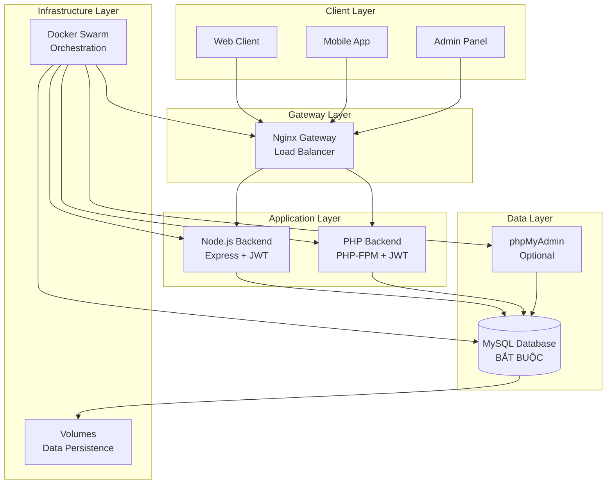

## 🔄 Luồng xử lý request

### 1. Authentication Flow

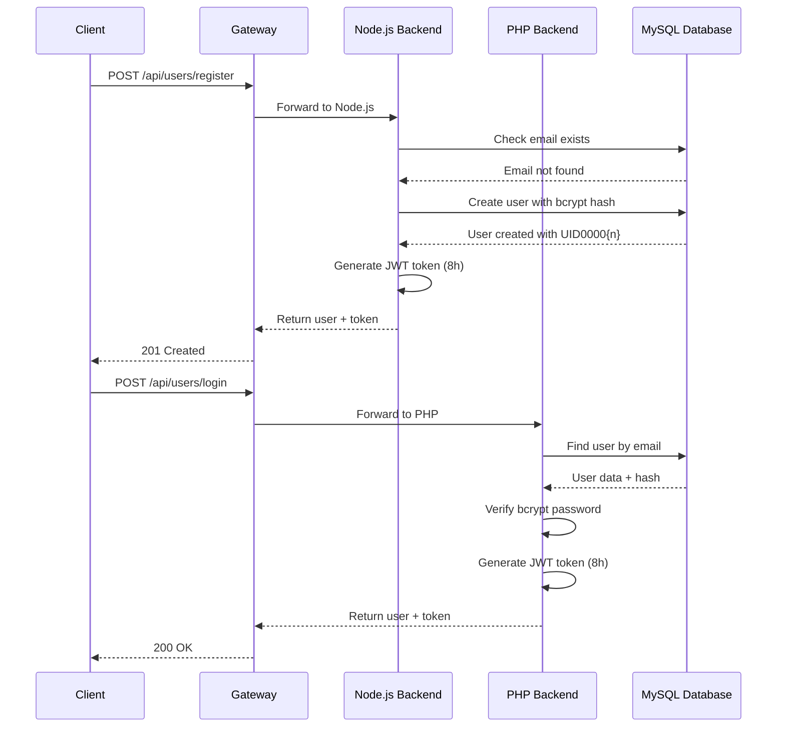

### 2. Order Creation Flow

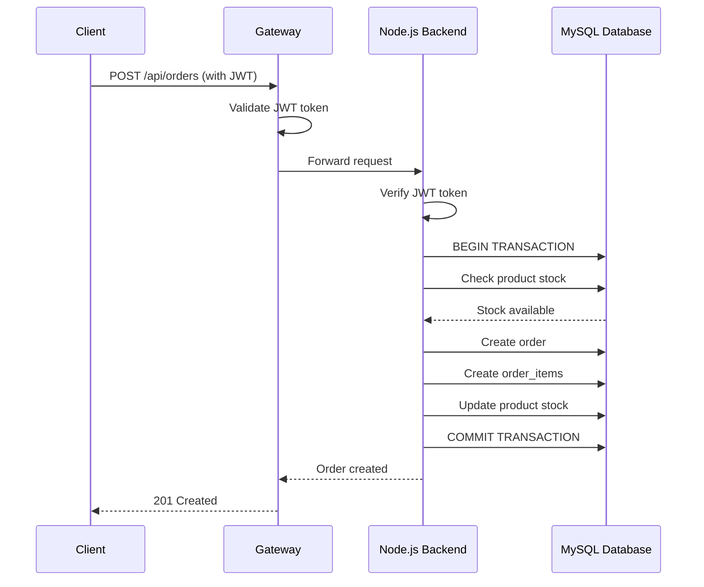

## 🗄️ Database Design

### Entity Relationship Diagram

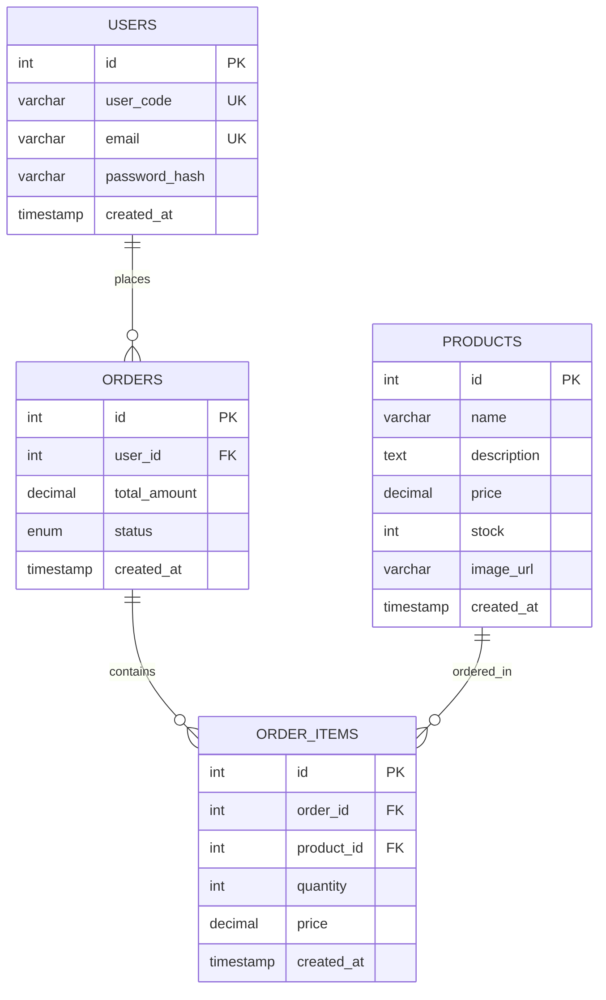

### Database Triggers

```sql
-- Auto-generate user_code after user insert
CREATE TRIGGER tr_users_after_insert
AFTER INSERT ON users
FOR EACH ROW
BEGIN
    UPDATE users 
    SET user_code = CONCAT('UID', LPAD(NEW.id, 5, '0'))
    WHERE id = NEW.id;
END;

-- Update stock after order item insert
CREATE TRIGGER tr_order_items_after_insert
AFTER INSERT ON order_items
FOR EACH ROW
BEGIN
    UPDATE products 
    SET stock = stock - NEW.quantity
    WHERE id = NEW.product_id;
END;
```

## 🔐 Security Architecture

### JWT Token Structure

```json
{
  "header": {
    "alg": "HS256",
    "typ": "JWT"
  },
  "payload": {
    "userId": 1,
    "userCode": "UID00001",
    "email": "user@example.com",
    "iat": 1640995200,
    "exp": 1641024000
  },
  "signature": "HMACSHA256(base64UrlEncode(header) + '.' + base64UrlEncode(payload), secret)"
}
```

### Authentication Flow

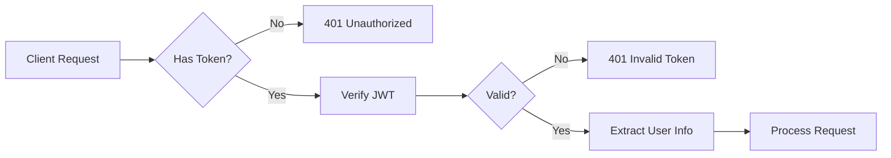

## 🚀 Deployment Architecture

### Docker Swarm Stack

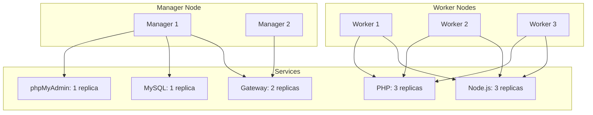

### Load Balancing Strategy

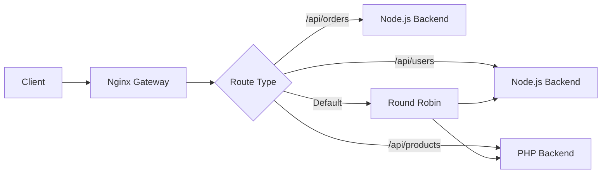

## 📊 Monitoring & Observability

### Health Check Endpoints

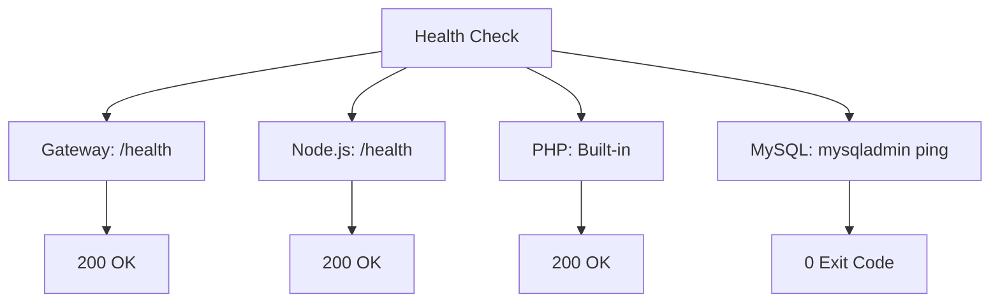

### Logging Strategy

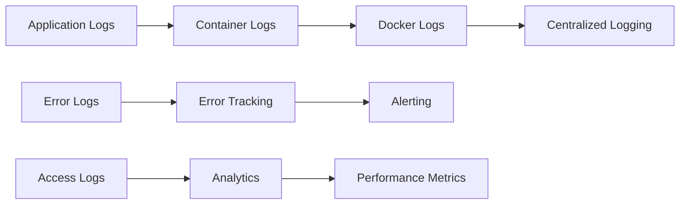

## 🔄 Data Flow Patterns

### Stateless Design

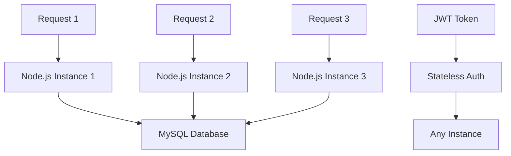

### Transaction Management

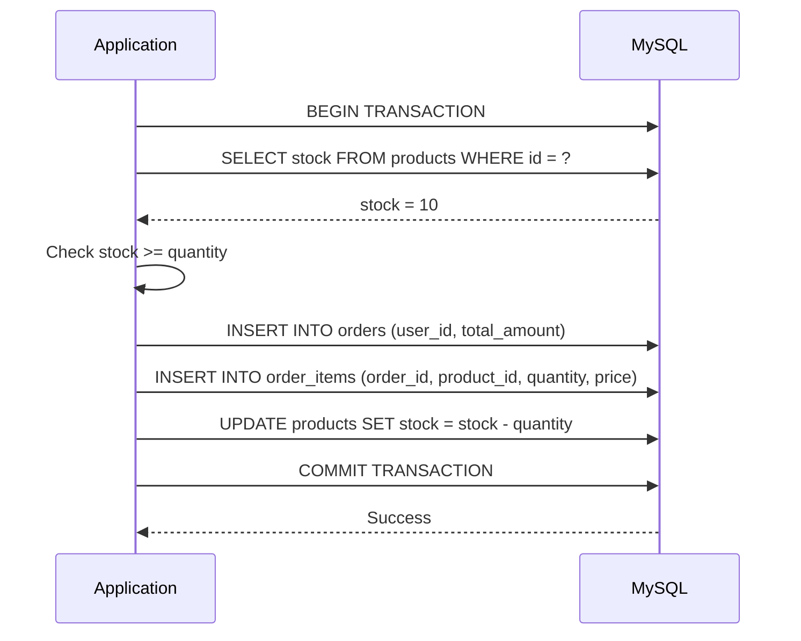

## 🎯 Performance Considerations

### Caching Strategy

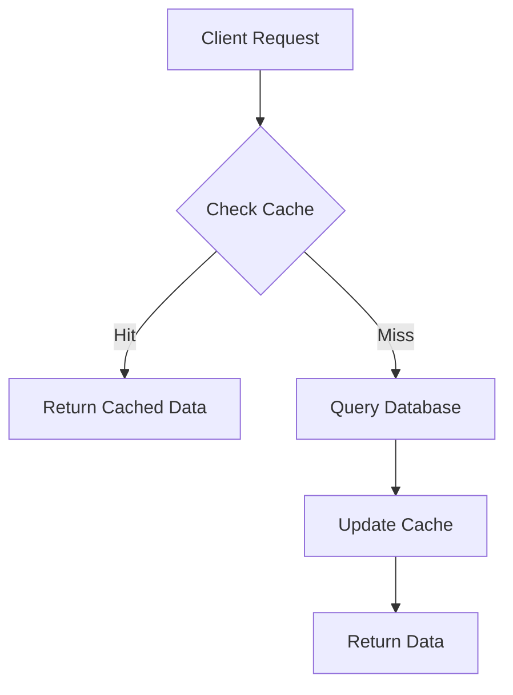

### Database Optimization

```sql
-- Indexes for performance
CREATE INDEX idx_users_email ON users(email);
CREATE INDEX idx_users_user_code ON users(user_code);
CREATE INDEX idx_products_name ON products(name);
CREATE INDEX idx_products_price ON products(price);
CREATE INDEX idx_orders_user_id ON orders(user_id);
CREATE INDEX idx_orders_created_at ON orders(created_at);
CREATE INDEX idx_order_items_order_id ON order_items(order_id);
CREATE INDEX idx_order_items_product_id ON order_items(product_id);
```

## 🔧 Configuration Management

### Environment-based Configuration

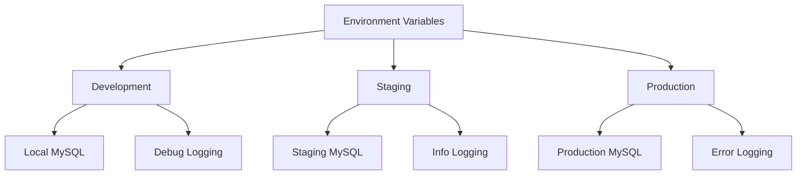

## 🚨 Error Handling Strategy

### Error Response Flow

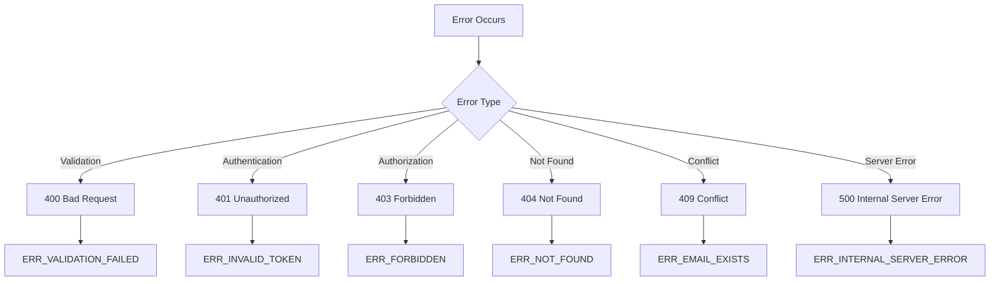

---

**⚠️ Lưu ý**: Kiến trúc này được thiết kế để đảm bảo tính nhất quán dữ liệu và khả năng mở rộng cao, với MySQL làm database chính duy nhất.
